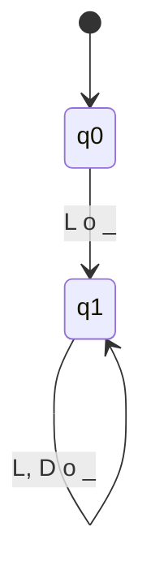
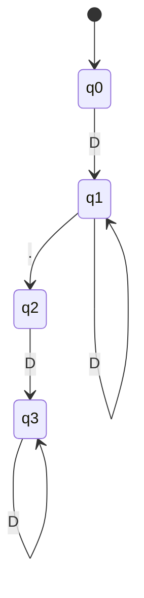
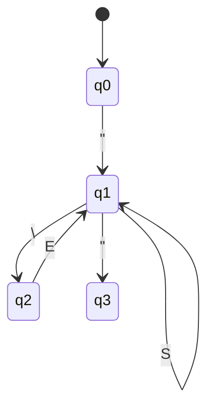
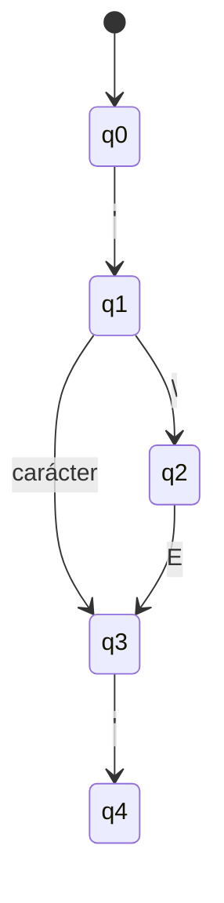
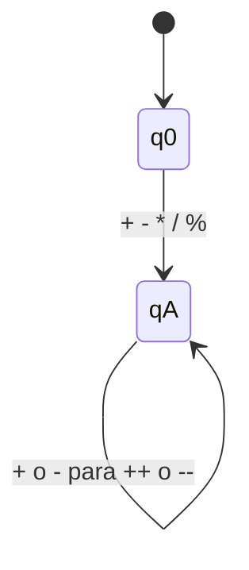
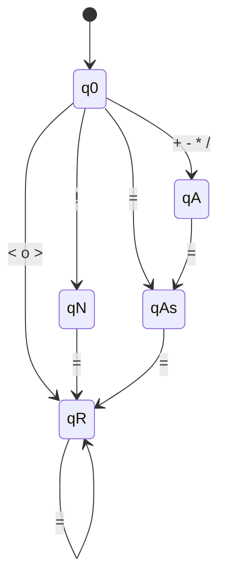
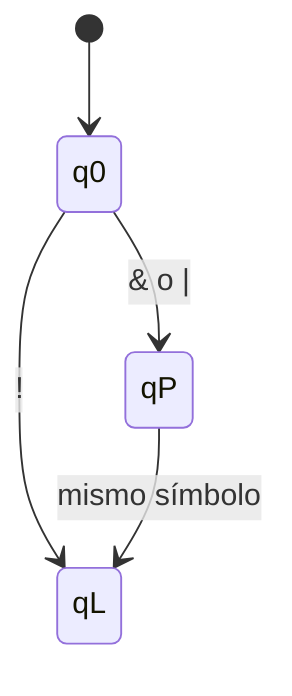
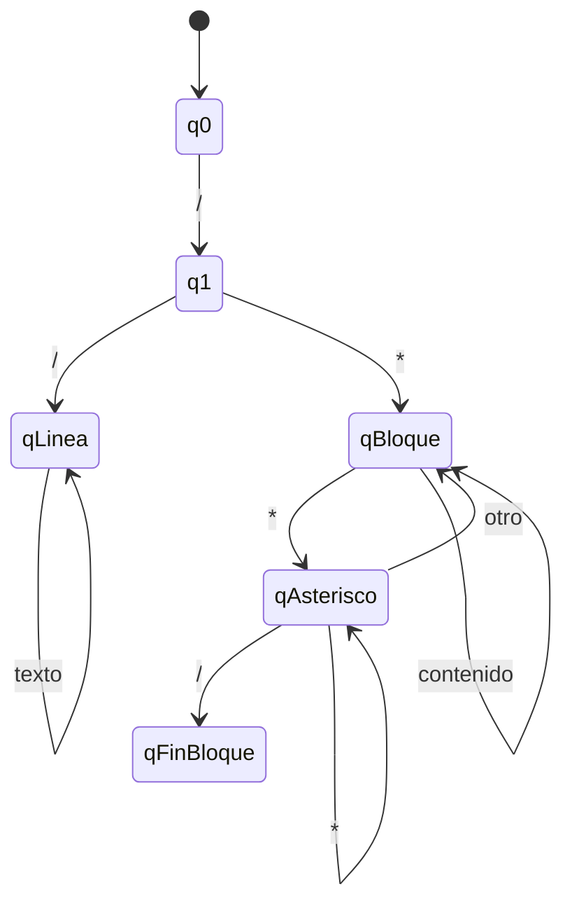
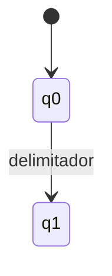

# Diseños de AFD

Los AFD descritos son implementados por las clases de `Automatas/` mediante `IntentarReconocer`. La clasificación de una palabra reservada ocurre después de aceptar un identificador. Los escapes admitidos en cadenas y caracteres son `\n`, `\t`, `\r`, `\\`, `\"`, `\'` y `\0`.

## 1. Identificadores
Reconoce `(L|_)(L|D|_)*`. Inicial: `q0`. Aceptación: `q1`.

## 2. Números
Reconoce enteros `D+` y reales `D+.D+`. Inicial: `q0`. Aceptación: `q1`, `q3`.

Una segunda marca decimal o letras a continuación de los dígitos se consume como una única secuencia errónea. Cuando hay letras, el error es identificador inválido; en los demás casos es número mal formado.

## 3. Cadenas
Reconoce texto entre comillas dobles y secuencias de escape. Inicial: `q0`. Aceptación: `q3`.

## 4. Caracteres
Reconoce un carácter simple o escape entre comillas simples. Inicial: `q0`. Aceptación: `q4`.

## 5. Operadores aritméticos
Reconoce `+`, `-`, `*`, `/`, `%`, `++` y `--`. Inicial: `q0`. Aceptación: `qA`.

## 6. Relacionales y asignación
Reconoce `==`, `!=`, `<`, `>`, `<=`, `>=`, `=`, `+=`, `-=`, `*=`, `/=`. Inicial: `q0`. Aceptación: `qR`, `qAs`.

## 7. Operadores lógicos
Reconoce `&&`, `||` y `!`. Inicial: `q0`. Aceptación: `qL`.

Un `&` o `|` aislado llega a rechazo y se informa como carácter no reconocido.

## 8. Comentarios
Reconoce comentarios de línea `//` y bloque `/*...*/`. Inicial: `q0`. Aceptación: `qLinea`, `qFinBloque`.

## 9. Delimitadores
Reconoce `(`, `)`, `{`, `}`, `[`, `]`, `;`, `,` y `.`. Inicial: `q0`. Aceptación: `q1`.

