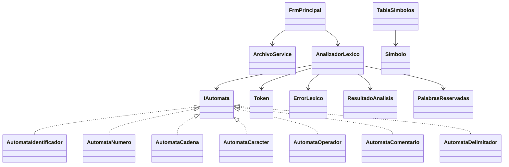

# Arquitectura

La interfaz se limita a cargar, solicitar el análisis y presentar datos. `AnalizadorLexico` coordina los AFD mediante `IAutomata.IntentarReconocer`, mantiene línea y columna y produce un `ResultadoAnalisis` con tokens, errores, símbolos y total de líneas. `TablaSimbolos` evita nombres duplicados y `ArchivoService` concentra la lectura de archivos.

